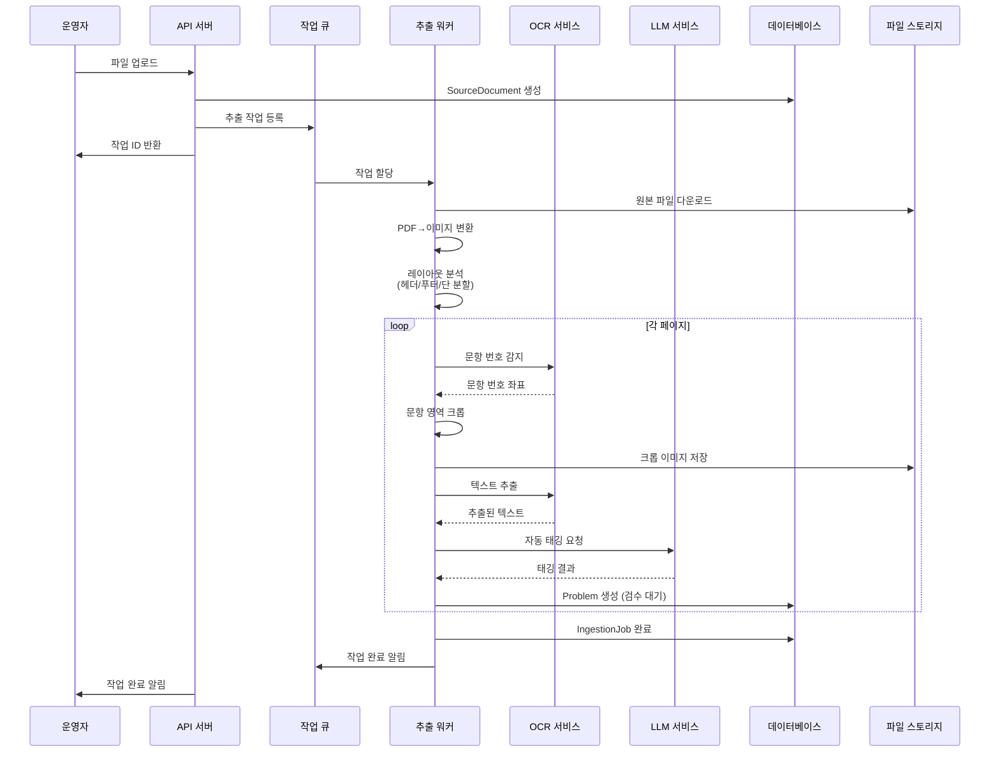
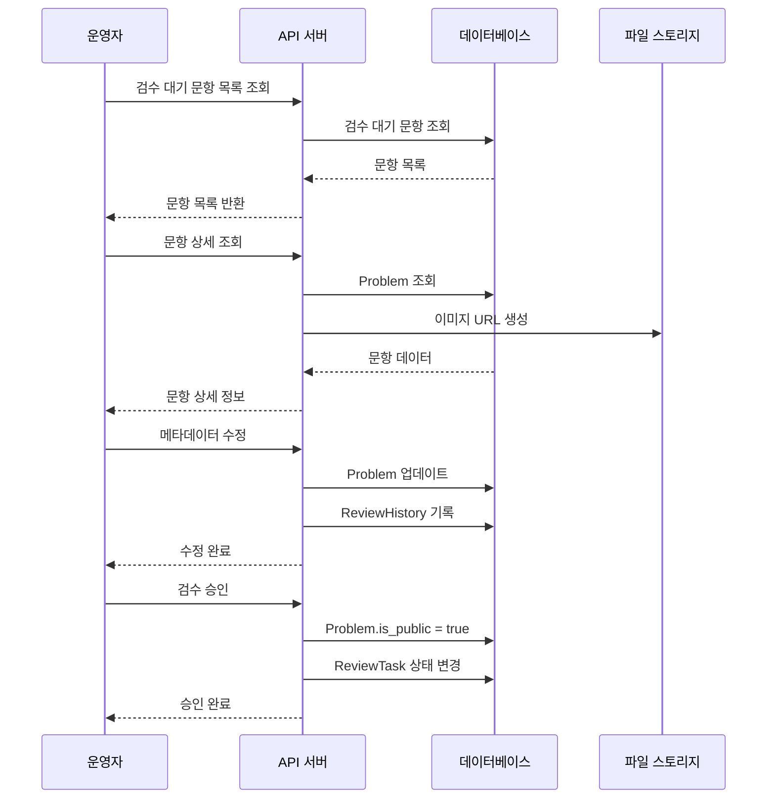
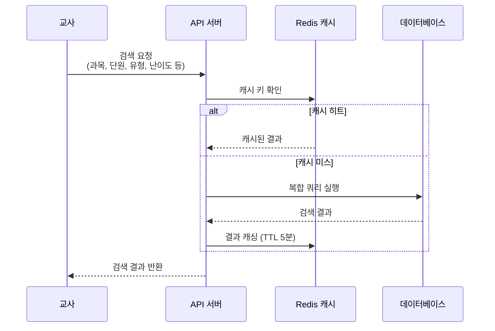
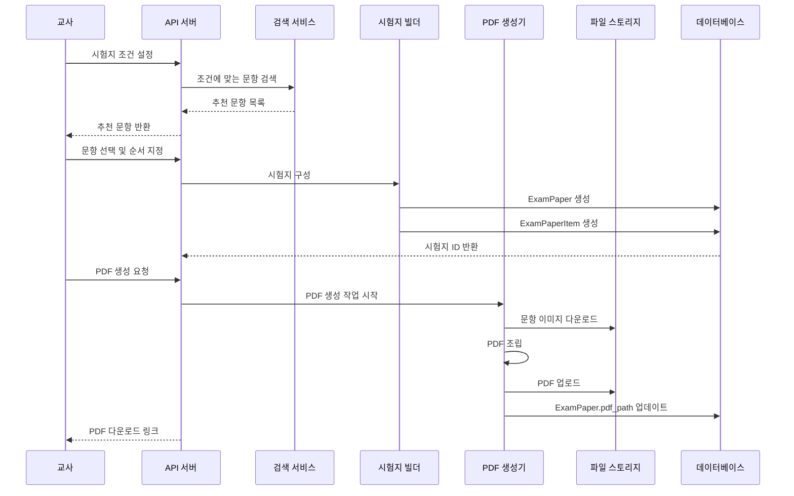

# 아키텍처 설계 문서

**버전**: 1.0  
**작성일**: 2026-01-27  
**관련 문서**: [PRD](prd.md), [요구사항](requirements.md), [데이터 모델](data-model.md)

---

## 1. 시스템 개요

### 1.1 아키텍처 스타일
- **마이크로서비스 아키텍처** (장기적으로)
- **모놀리식 + 비동기 작업 큐** (MVP 단계)

### 1.2 핵심 원칙
- **관심사 분리**: 추출, 검수, 검색, 시험지 생성 등 기능별 모듈 분리
- **비동기 처리**: 시간이 오래 걸리는 작업(OCR, LLM 태깅)은 큐로 처리
- **확장 가능성**: 수평 확장 가능한 구조
- **데이터 격리**: 조직(학원) 단위 데이터 격리

---

## 2. 시스템 아키텍처 다이어그램

```mermaid
graph TB
    subgraph "Frontend"
        WebApp[웹 애플리케이션(Next.js)]
        MobileApp[모바일 앱(로드맵)]
    end
    
    subgraph "API Gateway"
        API[FastAPI REST API]
    end
    
    subgraph "Core Services"
        AuthService[인증 서비스]
        ProblemService[문항 관리 서비스]
        SearchService[검색 서비스]
        ExamService[시험지 서비스]
    end
    
    subgraph "Background Workers"
        ExtractionWorker[추출 워커(Celery/RQ)]
        OCRWorker[OCR 워커]
        TaggingWorker[태깅 워커(LLM)]
    end
    
    subgraph "Data Layer"
        DB[(PostgreSQL 메인DB)]
        Redis[(Redis 캐시/큐)]
        S3[(S3호환 파일스토리지)]
    end
    
    subgraph "External Services"
        LLMAPI[LLM API(OpenAI/Claude)]
        HWPService[HWP 서비스(Windows 전용)]
    end
    
    WebApp --> API
    MobileApp --> API
    API --> AuthService
    API --> ProblemService
    API --> SearchService
    API --> ExamService
    
    ProblemService --> DB
    ProblemService --> Redis
    ProblemService --> S3
    ProblemService --> ExtractionWorker
    
    SearchService --> DB
    SearchService --> Redis
    
    ExamService --> DB
    ExamService --> S3
    
    ExtractionWorker --> OCRWorker
    ExtractionWorker --> TaggingWorker
    OCRWorker --> S3
    TaggingWorker --> LLMAPI
    TaggingWorker --> DB
    
    ExamService --> HWPService
```

---

## 3. 핵심 파이프라인

### 3.1 문항 추출 파이프라인



**주요 컴포넌트**:
1. **파일 업로드 핸들러**: 파일 검증 및 S3 업로드
2. **PDF 변환기**: PyMuPDF를 사용한 이미지 변환
3. **레이아웃 분석기**: OpenCV 기반 헤더/푸터/단 분할
4. **OCR 서비스**: EasyOCR을 사용한 텍스트 추출
5. **태깅 서비스**: LLM API를 사용한 자동 태깅

---

### 3.2 검수 워크플로우



**주요 컴포넌트**:
1. **검수 대시보드**: 검수 대기 문항 목록 및 통계
2. **검수 편집기**: 문항 정보 수정 인터페이스
3. **이력 관리**: 모든 변경 사항 기록

---

### 3.3 문항 검색 파이프라인



**주요 컴포넌트**:
1. **검색 엔진**: PostgreSQL의 인덱스 활용
2. **캐시 레이어**: Redis를 사용한 결과 캐싱
3. **필터링**: 다중 조건 필터링 및 정렬

---

### 3.4 시험지 생성 파이프라인



**주요 컴포넌트**:
1. **시험지 빌더**: 문항 선택 및 순서 관리
2. **PDF 생성기**: ReportLab 또는 유사 라이브러리 사용
3. **템플릿 엔진**: 시험지 레이아웃 템플릿 관리

---

## 4. 컴포넌트 상세 설계

### 4.1 API 서버 (FastAPI)

**책임**:
- RESTful API 제공
- 요청 검증 및 인증
- 비즈니스 로직 오케스트레이션
- 응답 포맷팅

**주요 엔드포인트**:
- `POST /api/v1/upload`: 파일 업로드
- `GET /api/v1/problems`: 문항 검색
- `POST /api/v1/exam-papers`: 시험지 생성
- `GET /api/v1/review-tasks`: 검수 작업 목록
- `PATCH /api/v1/problems/{id}`: 문항 수정

**의존성**:
- 데이터베이스 연결 풀
- Redis 클라이언트
- S3 클라이언트
- 작업 큐 클라이언트

---

### 4.2 추출 워커 (Celery/RQ)

**책임**:
- 비동기 문항 추출 작업 처리
- OCR 작업 오케스트레이션
- LLM 태깅 작업 오케스트레이션
- 진행률 업데이트

**주요 작업**:
- `extract_problems`: 소스 문서에서 문항 추출
- `ocr_text`: 이미지에서 텍스트 추출
- `tag_problem`: LLM을 사용한 자동 태깅

**의존성**:
- PyMuPDF (PDF 처리)
- OpenCV (이미지 처리)
- EasyOCR (OCR)
- LLM API 클라이언트

---

### 4.3 검색 서비스

**책임**:
- 문항 검색 쿼리 최적화
- 캐시 관리
- 결과 정렬 및 페이지네이션

**주요 기능**:
- 다중 조건 필터링
- 풀텍스트 검색 (PostgreSQL tsvector)
- 관련도 정렬

**최적화 전략**:
- 인덱스 활용 (복합 인덱스)
- Redis 캐싱 (인기 검색어)
- 쿼리 최적화 (N+1 문제 방지)

---

### 4.4 PDF 생성 서비스

**책임**:
- 시험지 PDF 생성
- 레이아웃 템플릿 적용
- 이미지 삽입 및 포맷팅

**주요 기능**:
- 문항 이미지 조합
- 페이지 레이아웃 관리
- 폰트 및 스타일 적용

**라이브러리**:
- ReportLab 또는 WeasyPrint
- PIL/Pillow (이미지 처리)

---

## 5. 데이터 흐름

### 5.1 파일 업로드 흐름

```
사용자 → API 서버 → S3 업로드 → DB 기록 → 작업 큐 등록
```

### 5.2 문항 검색 흐름

```
사용자 → API 서버 → Redis 캐시 확인 → DB 쿼리 → 결과 반환 → 캐시 저장
```

### 5.3 시험지 생성 흐름

```
사용자 → API 서버 → 검색 서비스 → 문항 선택 → DB 저장 → PDF 생성 → S3 저장 → 다운로드 링크 반환
```

---

## 6. 보안 아키텍처

### 6.1 인증 및 권한


**구현**:
- JWT 기반 인증
- 역할 기반 접근 제어 (RBAC)
- 조직 단위 데이터 격리

### 6.2 데이터 격리

- **조직 단위 격리**: 모든 쿼리에 `organization_id` 필터 적용
- **소프트 삭제**: `deleted_at` 필드로 논리적 삭제
- **감사 로그**: 모든 중요 작업 기록

---

## 7. 확장성 고려사항

### 7.1 수평 확장

- **API 서버**: 로드 밸런서 뒤에 여러 인스턴스 배포
- **워커**: 작업 큐를 사용하여 워커 수 조정 가능
- **데이터베이스**: 읽기 전용 복제본 활용

### 7.2 캐싱 전략

- **Redis 캐시**: 검색 결과, 세션 데이터
- **CDN**: 정적 파일 (이미지, PDF) 배포

### 7.3 비동기 처리

- **작업 큐**: Celery/RQ를 사용한 비동기 작업 처리
- **이벤트 기반**: 작업 완료 시 웹소켓 또는 폴링으로 알림

---

## 8. 모니터링 및 관측성

### 8.1 로깅

- **구조화된 로깅**: JSON 형식 로그
- **로그 레벨**: DEBUG, INFO, WARNING, ERROR
- **중앙 집중식 로깅**: ELK 스택 또는 유사 솔루션

### 8.2 메트릭

- **애플리케이션 메트릭**: Prometheus + Grafana
- **시스템 메트릭**: CPU, 메모리, 디스크 사용률
- **비즈니스 메트릭**: 작업 처리 시간, 검수 완료율

### 8.3 추적

- **분산 추적**: OpenTelemetry 또는 Jaeger
- **요청 추적**: 요청 ID를 통한 전체 요청 추적

---

## 9. 배포 아키텍처

### 9.1 MVP 배포 구조

```
[로드 밸런서]
    ↓
[API 서버 × 2]
    ↓
[PostgreSQL (마스터)]
    ↓
[Redis]
    ↓
[S3 호환 스토리지]
    ↓
[워커 × 2]
```

### 9.2 컨테이너화

- **Docker**: 모든 서비스를 컨테이너화
- **Docker Compose**: 로컬 개발 환경
- **Kubernetes**: 프로덕션 배포 (장기적으로)

---

## 10. 기술 스택 매핑

| 컴포넌트 | 기술 스택 |
|---------|----------|
| API 서버 | FastAPI (Python) |
| 프론트엔드 | Next.js (React) |
| 데이터베이스 | PostgreSQL |
| 캐시/큐 | Redis |
| 작업 큐 | Celery 또는 RQ |
| 파일 스토리지 | S3 호환 (MinIO 또는 AWS S3) |
| PDF 처리 | PyMuPDF, ReportLab |
| 이미지 처리 | OpenCV, PIL |
| OCR | EasyOCR |
| LLM | OpenAI API 또는 Claude API |
| 모니터링 | Prometheus, Grafana, Sentry |

자세한 기술 스택 정보는 [기술스택 문서](tech-stack.md) 참조.

---

## 11. 참고 문서

- [PRD](prd.md)
- [요구사항](requirements.md)
- [데이터 모델](data-model.md)
- [기술스택](tech-stack.md)
