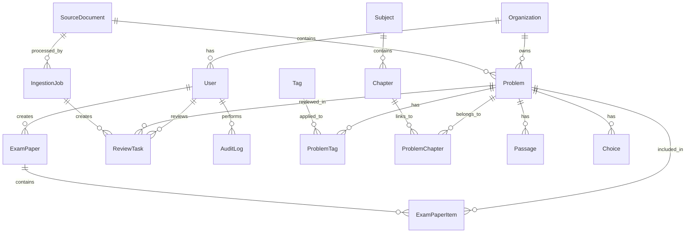

# 데이터 모델 문서

**버전**: 1.0  
**작성일**: 2026-01-27  
**관련 문서**: [PRD](prd.md), [요구사항](requirements.md)

---

## 1. 개요

이 문서는 학원용 문제 제출기 시스템의 데이터베이스 스키마를 정의합니다. PostgreSQL을 기본 데이터베이스로 가정하며, 필요시 SQLite로 시작할 수 있습니다.

---

## 2. 엔티티 관계도 (ERD)



---

## 3. 주요 엔티티 상세

### 3.1 User (사용자)

사용자 인증 및 권한 관리

| 필드명 | 타입 | 제약조건 | 설명 |
|--------|------|----------|------|
| id | UUID | PK | 사용자 고유 ID |
| email | VARCHAR(255) | UNIQUE, NOT NULL | 이메일 주소 |
| password_hash | VARCHAR(255) | NOT NULL | 비밀번호 해시 (bcrypt) |
| name | VARCHAR(100) | NOT NULL | 이름 |
| role | ENUM | NOT NULL | 역할 (admin, operator, teacher, student) |
| organization_id | UUID | FK → Organization | 소속 조직 |
| is_active | BOOLEAN | DEFAULT true | 활성화 여부 |
| created_at | TIMESTAMP | DEFAULT NOW() | 생성 시간 |
| updated_at | TIMESTAMP | DEFAULT NOW() | 수정 시간 |

**인덱스**:
- `idx_user_email`: email
- `idx_user_organization`: organization_id

---

### 3.2 Organization (조직/학원)

조직 단위 데이터 격리

| 필드명 | 타입 | 제약조건 | 설명 |
|--------|------|----------|------|
| id | UUID | PK | 조직 고유 ID |
| name | VARCHAR(200) | NOT NULL | 조직명 |
| domain | VARCHAR(100) | UNIQUE | 도메인 (선택적) |
| is_active | BOOLEAN | DEFAULT true | 활성화 여부 |
| created_at | TIMESTAMP | DEFAULT NOW() | 생성 시간 |
| updated_at | TIMESTAMP | DEFAULT NOW() | 수정 시간 |

**인덱스**:
- `idx_organization_domain`: domain

---

### 3.3 Subject (과목)

과목 정보

| 필드명 | 타입 | 제약조건 | 설명 |
|--------|------|----------|------|
| id | UUID | PK | 과목 고유 ID |
| name | VARCHAR(100) | NOT NULL, UNIQUE | 과목명 (국어, 수학, 영어 등) |
| code | VARCHAR(20) | UNIQUE | 과목 코드 |
| display_order | INTEGER | DEFAULT 0 | 표시 순서 |
| is_active | BOOLEAN | DEFAULT true | 활성화 여부 |
| created_at | TIMESTAMP | DEFAULT NOW() | 생성 시간 |

**인덱스**:
- `idx_subject_code`: code

---

### 3.4 Chapter (단원)

과목별 단원 정보

| 필드명 | 타입 | 제약조건 | 설명 |
|--------|------|----------|------|
| id | UUID | PK | 단원 고유 ID |
| subject_id | UUID | FK → Subject, NOT NULL | 과목 ID |
| name | VARCHAR(200) | NOT NULL | 단원명 |
| code | VARCHAR(50) | | 단원 코드 |
| parent_id | UUID | FK → Chapter | 상위 단원 (계층 구조) |
| display_order | INTEGER | DEFAULT 0 | 표시 순서 |
| is_active | BOOLEAN | DEFAULT true | 활성화 여부 |
| created_at | TIMESTAMP | DEFAULT NOW() | 생성 시간 |

**인덱스**:
- `idx_chapter_subject`: subject_id
- `idx_chapter_parent`: parent_id

---

### 3.5 SourceDocument (소스 문서)

원본 시험지 파일 정보

| 필드명 | 타입 | 제약조건 | 설명 |
|--------|------|----------|------|
| id | UUID | PK | 문서 고유 ID |
| organization_id | UUID | FK → Organization | 소속 조직 |
| title | VARCHAR(500) | NOT NULL | 문서 제목 |
| file_type | VARCHAR(20) | NOT NULL | 파일 형식 (PDF, PNG, JPG, HWP) |
| file_path | VARCHAR(1000) | NOT NULL | 파일 저장 경로 (S3) |
| file_size | BIGINT | | 파일 크기 (bytes) |
| page_count | INTEGER | | 페이지 수 |
| source | VARCHAR(200) | | 출처 (저작권자, 출판사 등) |
| copyright_info | TEXT | | 저작권 정보 |
| exam_year | INTEGER | | 출제 연도 |
| exam_month | INTEGER | | 출제 월 |
| exam_round | INTEGER | | 출제 회차 |
| uploaded_by | UUID | FK → User | 업로드한 사용자 |
| status | ENUM | DEFAULT 'pending' | 상태 (pending, processing, completed, failed) |
| created_at | TIMESTAMP | DEFAULT NOW() | 생성 시간 |
| updated_at | TIMESTAMP | DEFAULT NOW() | 수정 시간 |
| deleted_at | TIMESTAMP | | 삭제 시간 (소프트 삭제) |

**인덱스**:
- `idx_source_doc_organization`: organization_id
- `idx_source_doc_status`: status
- `idx_source_doc_uploaded_by`: uploaded_by

---

### 3.6 IngestionJob (추출 작업)

문항 추출 작업 정보

| 필드명 | 타입 | 제약조건 | 설명 |
|--------|------|----------|------|
| id | UUID | PK | 작업 고유 ID |
| source_document_id | UUID | FK → SourceDocument, NOT NULL | 소스 문서 ID |
| status | ENUM | DEFAULT 'pending' | 상태 (pending, processing, completed, failed) |
| progress | INTEGER | DEFAULT 0 | 진행률 (0-100) |
| pages_processed | INTEGER | DEFAULT 0 | 처리된 페이지 수 |
| problems_extracted | INTEGER | DEFAULT 0 | 추출된 문항 수 |
| error_message | TEXT | | 오류 메시지 |
| started_at | TIMESTAMP | | 시작 시간 |
| completed_at | TIMESTAMP | | 완료 시간 |
| created_at | TIMESTAMP | DEFAULT NOW() | 생성 시간 |

**인덱스**:
- `idx_ingestion_job_source_doc`: source_document_id
- `idx_ingestion_job_status`: status

---

### 3.7 Problem (문항)

추출된 문항 정보

| 필드명 | 타입 | 제약조건 | 설명 |
|--------|------|----------|------|
| id | UUID | PK | 문항 고유 ID |
| organization_id | UUID | FK → Organization | 소속 조직 |
| source_document_id | UUID | FK → SourceDocument | 소스 문서 ID |
| problem_number | INTEGER | | 문항 번호 (원본 문서 기준) |
| page_number | INTEGER | | 페이지 번호 |
| image_path | VARCHAR(1000) | | 크롭된 이미지 경로 (S3) |
| text_content | JSONB | | 추출된 텍스트(정규화 전 Canonical), 검색용 tsvector 파생 가능 |
| problem_type | ENUM | | 유형 (multiple_choice, short_answer, essay, passage_based) |
| difficulty | INTEGER | | 난이도 (1-5 또는 NULL) |
| estimated_time | INTEGER | | 예상 소요 시간 (초) |
| is_public | BOOLEAN | DEFAULT false | 공개 여부 (검수 완료 후 true) |
| reviewed_at | TIMESTAMP | | 검수 완료 시간 |
| reviewed_by | UUID | FK → User | 검수한 사용자 |
| created_at | TIMESTAMP | DEFAULT NOW() | 생성 시간 |
| updated_at | TIMESTAMP | DEFAULT NOW() | 수정 시간 |
| deleted_at | TIMESTAMP | | 삭제 시간 (소프트 삭제) |

**인덱스**:
- `idx_problem_organization`: organization_id
- `idx_problem_source_doc`: source_document_id
- `idx_problem_is_public`: is_public
- `idx_problem_difficulty`: difficulty
- `idx_problem_type`: problem_type
- `idx_problem_created_at`: created_at

**text_content JSON 구조(예시)**:
```json
{
  "passage": "지문 내용",
  "question": "문제 내용",
  "choices": [
    {"number": 1, "text": "선택지 1"},
    {"number": 2, "text": "선택지 2"}
  ]
}
```

> 참고: 정답/해설은 일반적으로 원본 시험지에 포함되지 않으므로, MVP에서는 필수로 다루지 않습니다.  
> 로드맵에서 온라인 풀이/채점을 지원하려면 “정답지/해설지 업로드 + 매핑” 또는 “운영자 수동 입력/검수”가 추가로 필요합니다.

---

### 3.8 Passage (지문)

문항과 연결된 읽기 자료 (지문형 문제)

| 필드명 | 타입 | 제약조건 | 설명 |
|--------|------|----------|------|
| id | UUID | PK | 지문 고유 ID |
| problem_id | UUID | FK → Problem, NOT NULL | 문항 ID |
| content | TEXT | NOT NULL | 지문 내용 |
| image_path | VARCHAR(1000) | | 지문 이미지 경로 |
| display_order | INTEGER | DEFAULT 0 | 표시 순서 |
| created_at | TIMESTAMP | DEFAULT NOW() | 생성 시간 |

**인덱스**:
- `idx_passage_problem`: problem_id

---

### 3.9 Choice (선택지)

객관식 문항의 보기

> 구현 선택지: `text_content`(JSONB)만을 Canonical로 유지하고 `Passage/Choice`를 저장하지 않거나, 반대로 `Passage/Choice`로 정규화하고 `text_content`는 캐시/원문 보존용으로만 두는 방식 중 하나를 선택해야 중복 저장/동기화 문제가 줄어듭니다.

| 필드명 | 타입 | 제약조건 | 설명 |
|--------|------|----------|------|
| id | UUID | PK | 선택지 고유 ID |
| problem_id | UUID | FK → Problem, NOT NULL | 문항 ID |
| number | INTEGER | NOT NULL | 선택지 번호 (1, 2, 3, 4, 5 등) |
| text | TEXT | NOT NULL | 선택지 내용 |
| is_correct | BOOLEAN | DEFAULT false | 정답 여부 |
| display_order | INTEGER | DEFAULT 0 | 표시 순서 |
| created_at | TIMESTAMP | DEFAULT NOW() | 생성 시간 |

**인덱스**:
- `idx_choice_problem`: problem_id
- `idx_choice_number`: number

---

### 3.10 Tag (태그)

문항 분류 태그 (과목, 단원, 유형 등)

| 필드명 | 타입 | 제약조건 | 설명 |
|--------|------|----------|------|
| id | UUID | PK | 태그 고유 ID |
| name | VARCHAR(100) | NOT NULL, UNIQUE | 태그명 |
| category | ENUM | NOT NULL | 카테고리 (subject, chapter, type, difficulty, etc.) |
| display_order | INTEGER | DEFAULT 0 | 표시 순서 |
| is_active | BOOLEAN | DEFAULT true | 활성화 여부 |
| created_at | TIMESTAMP | DEFAULT NOW() | 생성 시간 |

**인덱스**:
- `idx_tag_category`: category

---

### 3.11 ProblemTag (문항-태그 연결)

문항과 태그의 다대다 관계

| 필드명 | 타입 | 제약조건 | 설명 |
|--------|------|----------|------|
| id | UUID | PK | 연결 고유 ID |
| problem_id | UUID | FK → Problem, NOT NULL | 문항 ID |
| tag_id | UUID | FK → Tag, NOT NULL | 태그 ID |
| confidence | FLOAT | | 신뢰도 (0.0-1.0, 자동 태깅 시) |
| tagged_by | UUID | FK → User | 태깅한 사용자 (자동 태깅 시 NULL) |
| created_at | TIMESTAMP | DEFAULT NOW() | 생성 시간 |

**인덱스**:
- `idx_problem_tag_problem`: problem_id
- `idx_problem_tag_tag`: tag_id
- `UNIQUE(problem_id, tag_id)`: 중복 방지

---

### 3.12 ProblemChapter (문항-단원 연결)

문항과 단원의 다대다 관계 (한 문항이 여러 단원에 속할 수 있음)

| 필드명 | 타입 | 제약조건 | 설명 |
|--------|------|----------|------|
| id | UUID | PK | 연결 고유 ID |
| problem_id | UUID | FK → Problem, NOT NULL | 문항 ID |
| chapter_id | UUID | FK → Chapter, NOT NULL | 단원 ID |
| is_primary | BOOLEAN | DEFAULT false | 주요 단원 여부 |
| created_at | TIMESTAMP | DEFAULT NOW() | 생성 시간 |

**인덱스**:
- `idx_problem_chapter_problem`: problem_id
- `idx_problem_chapter_chapter`: chapter_id

---

### 3.13 ExamPaper (시험지)

생성된 시험지 정보

| 필드명 | 타입 | 제약조건 | 설명 |
|--------|------|----------|------|
| id | UUID | PK | 시험지 고유 ID |
| organization_id | UUID | FK → Organization | 소속 조직 |
| title | VARCHAR(500) | NOT NULL | 시험지 제목 |
| description | TEXT | | 설명 |
| subject_id | UUID | FK → Subject | 과목 |
| total_problems | INTEGER | NOT NULL | 총 문제 수 |
| estimated_time | INTEGER | | 예상 소요 시간 (분) |
| difficulty_distribution | JSONB | | 난이도 분포 (예: {"easy": 30, "medium": 50, "hard": 20}) |
| created_by | UUID | FK → User, NOT NULL | 생성한 사용자 |
| pdf_path | VARCHAR(1000) | | 생성된 PDF 경로 |
| is_published | BOOLEAN | DEFAULT false | 배포 여부 |
| published_at | TIMESTAMP | | 배포 시간 |
| created_at | TIMESTAMP | DEFAULT NOW() | 생성 시간 |
| updated_at | TIMESTAMP | DEFAULT NOW() | 수정 시간 |
| deleted_at | TIMESTAMP | | 삭제 시간 (소프트 삭제) |

**인덱스**:
- `idx_exam_paper_organization`: organization_id
- `idx_exam_paper_created_by`: created_by
- `idx_exam_paper_subject`: subject_id
- `idx_exam_paper_is_published`: is_published

---

### 3.14 ExamPaperItem (시험지-문항 연결)

시험지에 포함된 문항 정보

| 필드명 | 타입 | 제약조건 | 설명 |
|--------|------|----------|------|
| id | UUID | PK | 연결 고유 ID |
| exam_paper_id | UUID | FK → ExamPaper, NOT NULL | 시험지 ID |
| problem_id | UUID | FK → Problem, NOT NULL | 문항 ID |
| order_number | INTEGER | NOT NULL | 문항 순서 |
| points | INTEGER | DEFAULT 1 | 배점 |
| created_at | TIMESTAMP | DEFAULT NOW() | 생성 시간 |

**인덱스**:
- `idx_exam_paper_item_exam`: exam_paper_id
- `idx_exam_paper_item_problem`: problem_id
- `UNIQUE(exam_paper_id, order_number)`: 순서 중복 방지

---

### 3.15 ReviewTask (검수 작업)

문항 검수 작업 정보

| 필드명 | 타입 | 제약조건 | 설명 |
|--------|------|----------|------|
| id | UUID | PK | 검수 작업 고유 ID |
| problem_id | UUID | FK → Problem, NOT NULL | 문항 ID |
| ingestion_job_id | UUID | FK → IngestionJob | 추출 작업 ID |
| status | ENUM | DEFAULT 'pending' | 상태 (pending, in_progress, approved, rejected) |
| assigned_to | UUID | FK → User | 담당 검수자 |
| reviewed_at | TIMESTAMP | | 검수 완료 시간 |
| review_notes | TEXT | | 검수 메모 |
| created_at | TIMESTAMP | DEFAULT NOW() | 생성 시간 |
| updated_at | TIMESTAMP | DEFAULT NOW() | 수정 시간 |

**인덱스**:
- `idx_review_task_problem`: problem_id
- `idx_review_task_status`: status
- `idx_review_task_assigned_to`: assigned_to

---

### 3.16 ReviewHistory (검수 이력)

문항 검수 변경 이력

| 필드명 | 타입 | 제약조건 | 설명 |
|--------|------|----------|------|
| id | UUID | PK | 이력 고유 ID |
| problem_id | UUID | FK → Problem, NOT NULL | 문항 ID |
| review_task_id | UUID | FK → ReviewTask | 검수 작업 ID |
| changed_field | VARCHAR(100) | | 변경된 필드명 |
| old_value | TEXT | | 이전 값 |
| new_value | TEXT | | 새 값 |
| changed_by | UUID | FK → User, NOT NULL | 변경한 사용자 |
| created_at | TIMESTAMP | DEFAULT NOW() | 변경 시간 |

**인덱스**:
- `idx_review_history_problem`: problem_id
- `idx_review_history_changed_by`: changed_by

---

### 3.17 AuditLog (감사 로그)

모든 중요 작업 기록

| 필드명 | 타입 | 제약조건 | 설명 |
|--------|------|----------|------|
| id | UUID | PK | 로그 고유 ID |
| user_id | UUID | FK → User | 사용자 ID |
| organization_id | UUID | FK → Organization | 조직 ID |
| action_type | VARCHAR(50) | NOT NULL | 작업 유형 (upload, review, create_exam, delete 등) |
| resource_type | VARCHAR(50) | | 리소스 유형 (problem, exam_paper 등) |
| resource_id | UUID | | 리소스 ID |
| details | JSONB | | 상세 정보 (JSON 형식) |
| ip_address | VARCHAR(45) | | IP 주소 |
| user_agent | VARCHAR(500) | | User Agent |
| created_at | TIMESTAMP | DEFAULT NOW() | 기록 시간 |

**인덱스**:
- `idx_audit_log_user`: user_id
- `idx_audit_log_organization`: organization_id
- `idx_audit_log_action_type`: action_type
- `idx_audit_log_created_at`: created_at
- `idx_audit_log_resource`: (resource_type, resource_id)

---

## 4. 데이터 무결성 제약조건

### 4.1 외래키 제약조건
- 모든 외래키는 `ON DELETE CASCADE` 또는 `ON DELETE SET NULL` 설정
- 소프트 삭제를 사용하는 경우 `deleted_at` 필드 활용

### 4.2 체크 제약조건
- `Problem.difficulty`: 1-5 범위 또는 NULL
- `Problem.problem_type`: ENUM 값만 허용
- `ExamPaper.total_problems`: 1 이상
- `ReviewTask.status`: ENUM 값만 허용

### 4.3 고유 제약조건
- `User.email`: UNIQUE
- `Organization.domain`: UNIQUE (NULL 허용)
- `Subject.name`: UNIQUE
- `Tag.name`: UNIQUE
- `ProblemTag(problem_id, tag_id)`: UNIQUE
- `ExamPaperItem(exam_paper_id, order_number)`: UNIQUE

---

## 5. 인덱스 전략

### 5.1 기본 인덱스
- 모든 PK는 자동 인덱스
- 모든 FK는 인덱스 생성 (조회 성능 향상)

### 5.2 검색 최적화 인덱스
- `Problem`: is_public, difficulty, problem_type, created_at (복합 인덱스 고려)
- `ProblemTag`: problem_id, tag_id (다대다 관계 조회)
- `ExamPaper`: organization_id, is_published, created_at

### 5.3 풀텍스트 검색
- `Problem.text_content`: PostgreSQL의 `tsvector` 타입 사용 고려
- `GIN` 인덱스로 한국어 풀텍스트 검색 지원

---

## 6. 데이터 마이그레이션 전략

### 6.1 초기 스키마 생성
- 모든 테이블 생성
- 기본 데이터 삽입 (Subject, Tag 등)
- 인덱스 생성

### 6.2 버전 관리
- Alembic 또는 유사 도구 사용
- 마이그레이션 스크립트 버전 관리

---

## 7. 참고 문서

- [PRD](prd.md)
- [요구사항](requirements.md)
- [아키텍처](architecture.md)
